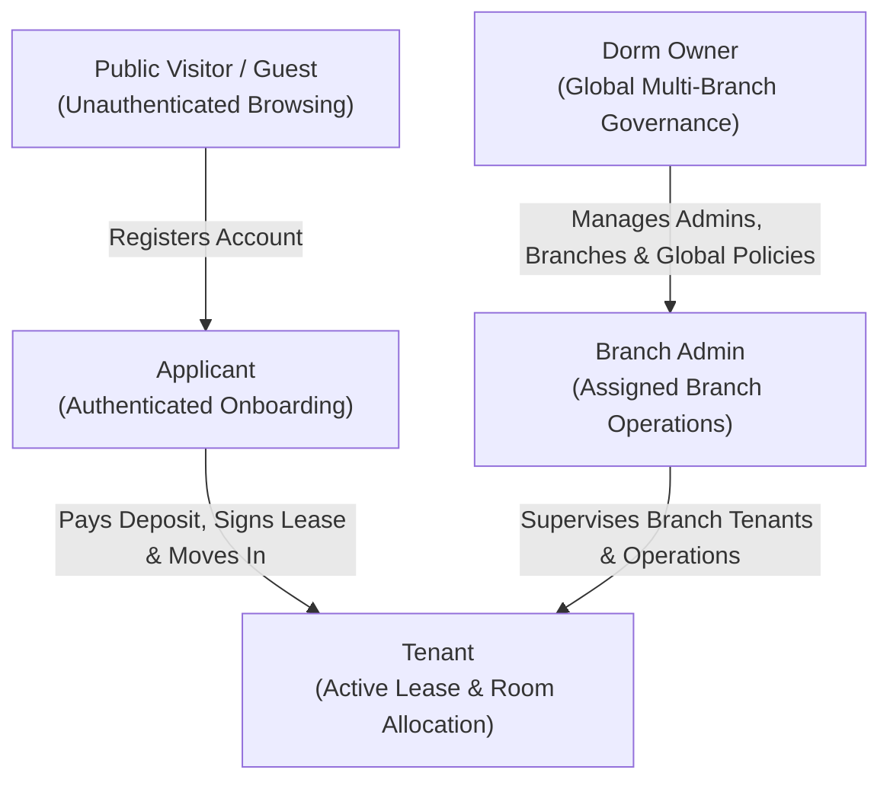
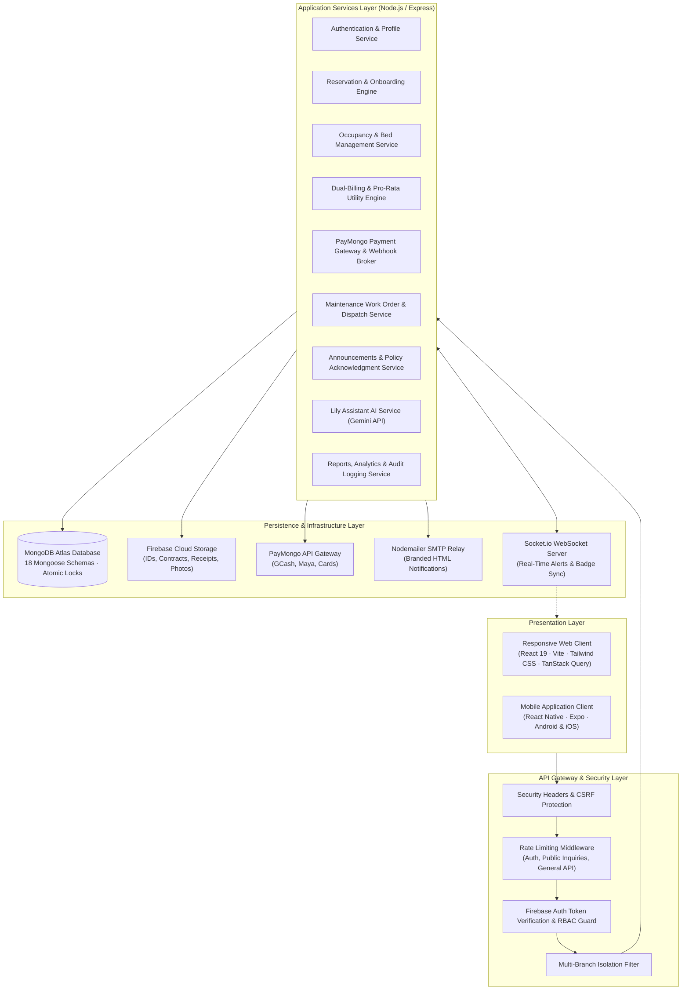
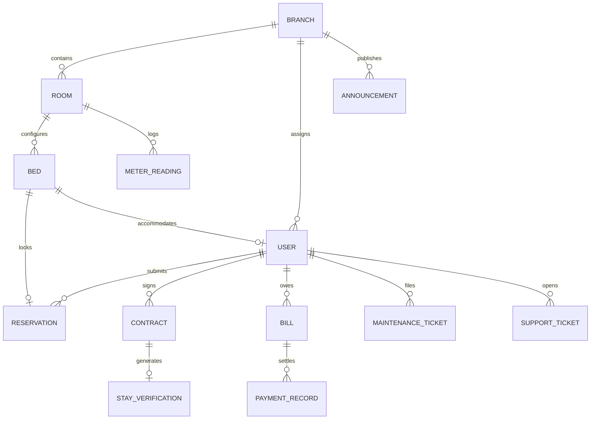

# Product Requirement Document (PRD)
## LILIORA: Lilycrest Dormitory Management System (Lilycrest DMS)

---

| Document Information | Details |
| :--- | :--- |
| **Product Name** | LILIORA — Lilycrest Dormitory Management System (Lilycrest DMS) |
| **Document Version** | 1.0.0 (Comprehensive Baseline) |
| **Target Facilities** | Lilycrest Residences (Multi-Branch: Gil Puyat & Guadalupe, Metro Manila) |
| **Platforms** | Responsive Web Application (React 19 / Vite) & Mobile Application (React Native / iOS & Android) |
| **Primary Stakeholders** | Dorm Owner, Branch Administrators, Active Tenants, Room Applicants, Public Visitors |
| **Target Audience** | Executive Leadership, Software Engineers, UI/UX Craftsmen, QA Testers, Capstone Advisers |

---

## 1. Executive Summary & Vision

### 1.1 Product Vision
**LILIORA (Lilycrest Dormitory Management System)** is an enterprise-grade, multi-branch dormitory operations and tenancy management ecosystem. The platform bridges the operational divide between physical facility administration and digital tenant experiences by unifying bed-level inventory, automated tenant onboarding, multi-channel payment reconciliation, pro-rata utility calculations, maintenance dispatching, and AI-driven user assistance into a cohesive web and mobile infrastructure.

### 1.2 Core Problem Statement
Prior to digitization, dormitory operations at Lilycrest Residences suffered from critical operational bottlenecks:
- **Bed Inventory Double-Booking**: Inquiries and reservation holds were recorded on disparate paper sheets and manual spreadsheets, leading to double-booked bunks during peak school enrollment cycles.
- **Complex Utility Splitting**: Rooms equipped with sub-meters required tedious manual calculations to split electricity and water bills across occupants who moved in or checked out on different calendar dates.
- **Unstructured Payment Reconciliation**: Cash handoffs, bank deposits, and mobile wallet payments were manually logged, leading to receipt discrepancies and delayed settlement tracking.
- **Scattered Maintenance Workflows**: Repair requests were sent through informal messaging channels without photo documentation, resulting in missed work orders and untracked contractor costs.
- **Disjointed Policy Enforcement & Communication**: Paper notices were easily overlooked, leaving management without verifiable audit trails of tenant policy acknowledgments.

### 1.3 Key Objectives & Success Criteria
| Objective | Baseline Metric | Target Success Metric |
| :--- | :--- | :--- |
| **Reservation Accuracy** | Manual spreadsheet logging with frequent conflicts | **0% Double-Booking Rate** via atomic bed-level reservation holds |
| **Utility Calculation Speed** | 3–5 business days per month of manual math | **Instant, Automated Pro-Rata Distribution** upon meter reading input |
| **Payment Reconciliation** | 24–48 hours manual bank receipt verification | **Instant Webhook Settlement** via PayMongo (GCash, Maya, Cards) |
| **Maintenance Tracking** | Unstructured messaging with delayed resolution | **100% Work Order Visibility** with photo proof & contractor attribution |
| **First-Line Tenant Support** | Admin phone calls during working hours only | **24/7 Context-Aware Assistance** via Lily Assistant AI |

---

## 2. User Roles & Access Hierarchy

The system enforces a strict 5-tier Role-Based Access Control (RBAC) hierarchy. Backend middleware and frontend route guards strictly restrict data access by role and branch assignment.

### 2.1 Role Matrix & Authorizations

| Role | Operational Scope | Permitted Capabilities & Authorizations |
| :--- | :--- | :--- |
| **Public Visitor** | Public Web / Landing | Browse available rooms across branches, view 360/gallery photos, check amenities and pricing, submit inquiries, schedule physical visits, verify tenant stay certificates. |
| **Applicant** | Self-Service Onboarding | Complete the 5-step room booking wizard, select available beds, pay reservation deposits with a live hold countdown timer, upload identification documents, and track application approval status. |
| **Tenant** | Active Tenancy Portal | View assigned room/bed space, review itemized monthly bills (Rent + Pro-rata Utilities), pay dues online via PayMongo, submit maintenance tickets with photos, view and acknowledge branch announcements, download lease agreements, and interact with Lily Assistant. |
| **Branch Admin** | Branch-Scoped Console | Manage rooms, beds, and real-time occupancy within their assigned physical branch; review and approve applicant reservations; record monthly electricity and water sub-meter readings; issue bills; dispatch maintenance staff; reconcile cash/bank payments; export branch operational reports. |
| **Dorm Owner** | System-Wide Multi-Branch | Unrestricted access across all dormitory branches; create and configure new branch locations; manage administrative user permissions; view cross-branch financial benchmarks and occupancy analytics; access immutable system audit logs; manage database backups. |

---

## 3. High-Level System Architecture

LILIORA is engineered around a modular, decoupled architecture ensuring full API parity between responsive web clients and native mobile applications.

---

## 4. Detailed Functional Modules & Requirements

### 4.1 Module 1: Authentication and Access Control
* **Cross-Platform Security**: Authenticates users across Web and Mobile via Firebase Authentication with secure HTTP-only session cookies and JWT bearer tokens.
* **Mobile Authentication Extensions**:
  - Native biometric login (Fingerprint and Face ID authentication).
  - Google OAuth 2.0 Single Sign-On.
  - Persistent encrypted token storage on device.
* **Strict Branch Isolation**: Branch Admin queries and database mutations are automatically scoped to `user.branchId`. Any cross-branch data manipulation attempt is rejected with a `403 Forbidden` response.
* **Account Lifecycle**: Supports registration, email verification links, self-service password recovery, profile editing, and administrative deactivation/suspension.

### 4.2 Module 2: Reservation Management & Tenant Onboarding Lifecycle
* **End-to-End Tenancy Flow**:
  1. *Room & Bed Selection*: The applicant selects a branch, room, and specific bed slot (e.g., Room 204, Bed Lower A).
  2. *Atomic Reservation Hold*: The selected bed is temporarily locked for 30 minutes with an active countdown timer, preventing concurrent checkouts.
  3. *Visit Scheduling*: Applicants can book an on-site facility tour or select their intended move-in date.
  4. *Document Submission*: Upload of valid government/school IDs and proof of enrollment/employment, stored in Firebase Cloud Storage.
  5. *Reservation Fee Payment*: Settlement of the non-refundable reservation deposit via PayMongo.
  6. *Administrative Review*: Branch Admins inspect uploaded credentials, approve or reject applications, and communicate feedback.
  7. *Digital Lease Signing*: Upon approval, an official lease agreement is dynamically rendered. The tenant signs using an in-browser canvas.
  8. *Move-In Settlement & Check-In*: Tenant settles the initial advance rent and security deposit. Branch Admins log the opening utility meter reading, hand over room keys, and set the account status to **Active Tenant**.
* **Contract Stays & Proof of Tenancy**:
  - Automatic expiration alerts 30 days prior to contract termination.
  - Stay extension requests handled directly inside the portal.
  - Cryptographic Public Verification (`/verify-stay/:token`) allowing employers or universities to verify bona fide tenancy via QR code without exposing personal details.

### 4.3 Module 3: Room and Bed Management
* **Visual Room Availability Grid**: Real-time display of physical dormitory layouts, floor levels, room types (Private, Double-Sharing, Quadruple-Sharing), and individual bed slots (Upper/Lower bunks).
* **Atomic Capacity Tracking**: Bed occupancies use atomic MongoDB `$inc` and `$set` operators during check-in and checkout to eliminate race conditions.
* **Status Flags**: Rooms and individual beds transition through `Available`, `Reserved`, `Occupied`, and `Maintenance` states.
* **Safety Deletion Guard**: System strictly blocks the deletion of rooms or beds that contain active tenancies or unreleased deposit records.

### 4.4 Module 4: Billing, Payments & AI-Assisted Utility Engine
* **Dual-Module Billing Architecture**:
  $$\text{Total Monthly Tenant Due} = \text{Base Room Rent} + \text{Pro-Rata Electricity} + \text{Pro-Rata Water} + \text{Appliance Fees} + \text{Penalties} - \text{Credits}$$
* **Pro-Rata Utility Math Model**:
  1. *Meter Delta Determination*:
     $$\Delta \text{Consumption} = \text{Current Meter Reading} - \text{Previous Meter Reading}$$
  2. *Total Room Utility Cost*:
     $$\text{Total Cost (PHP)} = \Delta \text{Consumption} \times \text{Applicable Utility Rate per Unit}$$
  3. *Active-Days Proportional Distribution*:
     $$\text{Tenant Share} = \text{Total Cost} \times \left( \frac{\text{Tenant Active Days in Billing Cycle}}{\sum_{i=1}^{N} \text{Occupant}_i \text{ Active Days}} \right)$$
  This guarantees that tenants checking in mid-cycle only pay for the exact days they occupied the room.
* **Payment Gateway & Webhook Reconciliation**:
  - Seamless checkout via PayMongo supporting **GCash**, **Maya**, **GrabPay**, and **Credit/Debit Cards**.
  - Secure cryptographic HMAC webhook verification on `payment.paid` events.
  - Atomically marks bills as `Paid`, generates an immutable digital transaction ledger, and issues a branded PDF receipt.
* **Lily Assistant AI Explainer**: Tenants can ask Lily Assistant to explain their statement of account in plain terms (e.g., *"Why is my electric bill ₱450 this month?"*). The assistant calculates the occupant count and active days, providing a transparent breakdown.

### 4.5 Module 5: Maintenance and Service Requests
* **Work Order Submission**: Tenants submit service tickets categorized by discipline (*Plumbing*, *Electrical*, *Air Conditioning*, *Cleaning*, *Pest Control*, *Furniture*, *General*) with priority levels and photo attachments.
* **Target Response Time Guidance**: Displays clear expectations (e.g., Urgent: within 4 hours; Normal: within 24 hours; Low: within 48 hours).
* **Contractor Assignment & Cost Attribution**: Branch Admins schedule internal staff or third-party contractors and record itemized repair costs. Costs can be classified as a dormitory operating expense or charged to the tenant if caused by negligence.
* **Resolution Verification**: Admins upload completion photos. Tenants confirm resolution to close the ticket or reopen if the defect persists.

### 4.6 Module 6: Announcements, Policies & Read Receipts
* **Targeted Broadcasting**: Branch Admins and Dorm Owners publish circulars with category tags (*Emergency*, *Maintenance*, *General*, *Event*) targeted to all branches, a specific branch, or specific floors.
* **Priority Pinning**: Critical circulars remain pinned at the top of web and mobile feeds.
* **Read Receipts & Policy Tracking**: Tenants submit a one-click acknowledgment for mandatory dormitory policies (Curfew Rules, Visitor Guidelines, Fire Safety). Admins track real-time compliance percentages.

### 4.7 Module 7: Reports, Multi-Branch Analytics & Audit Trail
* **Branch Admin Dashboard**: Local metrics on bed occupancy rates, active tenant headcounts, pending reservations, open repairs, and monthly collection revenue.
* **Dorm Owner Executive Console**: High-level cross-branch comparison benchmarking occupancy density, revenue per available bed (RevPAB), collection efficiency, and maintenance turnaround times.
* **Customizable Analytics Horizons**: Supports date ranges for `7 Days`, `30 Days`, `60 Days`, `90 Days`, `365 Days`, and `All-Time`.
* **Immutable Audit Trail**: Chronological, searchable record of all administrative logins, privilege elevations, billing adjustments, and status mutations with before-and-after snapshots and IP addresses.

### 4.8 Module 8: Support & AI Chatbot Module
* **Lily Assistant (Powered by Google Gemini)**:
  - *Public/Applicant Mode*: Answers FAQs regarding room rates, amenities, branch locations, and reservation steps 24/7.
  - *Tenant Mode*: Provides authenticated answers on rent due dates, utility computations, and house rules.
  - *Admin Assistant Mode*: Suggests standard operating procedure (SOP) replies and summarizes recurring tenant complaints.
* **Human Helpdesk Escalation**: If the inquiry requires human intervention, the system generates a threaded support ticket directed to the branch administration.

---

## 5. Non-Functional Requirements (NFRs)

### 5.1 Performance & Responsiveness
- **Web Client Performance**: Initial load time < 2.0 seconds on standard 4G broadband; sub-second transitions between dashboard tabs.
- **API Response Latencies**: Read endpoints < 150ms; transactional write endpoints < 300ms under normal load.
- **Zero Layout Shift**: Skeleton loaders (`*Skeleton.jsx`) displayed during asynchronous data fetching to eliminate visual layout shifts.

### 5.2 Security, Integrity & Compliance
- **Data Protection & Sanitization**: Comprehensive input sanitization guarding against NoSQL injection, XSS, and parameter tampering.
- **OWASP Compliance**: Secure HTTP headers enforced via Helmet, strict CORS origin whitelisting, and multi-tier rate limiting.
- **Sensitive Data Handling**: Zero plaintext passwords or secrets; cryptographic signature verification on all external payment webhooks.
- **Atomic Concurrency**: MongoDB transaction blocks and atomic `$inc` operators prevent simultaneous bookings of the same bed slot.

### 5.3 UI/UX Design System Guidelines
- **Strictly Zero Gradients**: Minimalist, flat, solid HSL color palette delivering crisp contrast and enterprise visual clarity.
- **Semantic Status Alignment**:
  - *Green / Emerald*: Paid, Moved In, Active Tenant, Resolved, Confirmed.
  - *Amber / Yellow*: Pending, Under Review, In Progress, Scheduled.
  - *Blue / Sky*: Inquiries, Information, Navigation, Selected Filter Tabs.
  - *Red / Rose*: Overdue, Rejected, Terminated, Violation, High Urgency.
  - *Neutral / Slate*: Archived, Draft, Neutral Stat Counters.
- **Badge & Border Invariant**: Status badges use transparent backgrounds with colored status dots and semantic text. No matching colored border outlines; structural borders must use clean neutral lines (`border-slate-200 dark:border-slate-700`).
- **Separation of Concerns**: KPI/Metric cards are purely informational and must not act as filter tabs. Filters must be explicit dropdowns or segmented controls.

---

## 6. Data Architecture & Database Models

The persistence layer comprises 18 Mongoose models structured to guarantee relational integrity within MongoDB Atlas:

### Key Data Entities
1. **User**: Authentication credentials, role (`guest`, `applicant`, `tenant`, `admin`, `owner`), branch assignment, contact information, profile photos.
2. **Branch**: Physical facility metadata (name, address, contact numbers, amenities list, configuration).
3. **Room**: Physical room number, floor level, room type, base monthly rent, total bed capacity, current occupancy count.
4. **Bed**: Bed slot identifier, position (Upper/Lower bunk), status (`available`, `reserved`, `occupied`, `maintenance`), current tenant reference.
5. **Reservation**: Application progress, intended move-in date, selected bed, uploaded verification files, deposit payment record, approval timestamps.
6. **Contract**: Legal lease terms, monthly rent, security deposit amount, signature canvas data, start and end dates, stay verification token.
7. **Bill**: Monthly invoice items (room rent, pro-rata electricity share, pro-rata water share, appliances, late fees), status (`Draft`, `Pending`, `Paid`, `Overdue`), due date.
8. **MeterReading**: Room sub-meter readings (electricity kWh, water cubic meters), photo proof, reading date, billing cycle tag.
9. **MaintenanceTicket**: Issue category, priority level, problem description, attached photos, assigned technician, cost attribution, resolution timeline.
10. **AuditLog**: Immutable event log tracking action type, user ID, branch, IP address, severity level, and before/after mutation diffs.

---

## 7. Quality Assurance, Testing & Deployment Gates

### 7.1 Automated Testing Matrix
The project maintains an automated test suite guaranteeing zero regressions across business-critical workflows:
- **Backend Test Suite**: 166 Jest test suites comprising over 1,600 test cases validating authentication, pro-rata math formulas, PayMongo webhook signatures, and RBAC permissions.
- **Frontend Build Validation**: Automated production builds via Vite (`npm run build`) ensuring zero TypeScript/JSX compilation errors or dead imports.
- **API Parity Verification**: Strict contract testing ensuring mobile clients (`/api/mobile/...`) and web controllers remain 100% synchronized.

### 7.2 Release & Quality Checklist
1. All unit and integration test suites pass with zero failures (`npm test`).
2. Web client compiles with zero warnings or dead imports (`npm run build`).
3. Multi-branch isolation verified: Admin accounts cannot access data from unauthorized branches.
4. Financial calculations verified against edge cases (mid-cycle move-in, empty rooms, leap years).
5. All UI components adhere to the Solid HSL design system with zero gradients and neutral badge borders.
