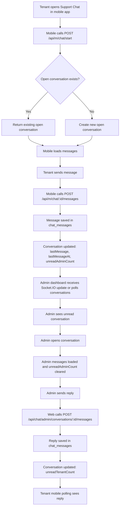
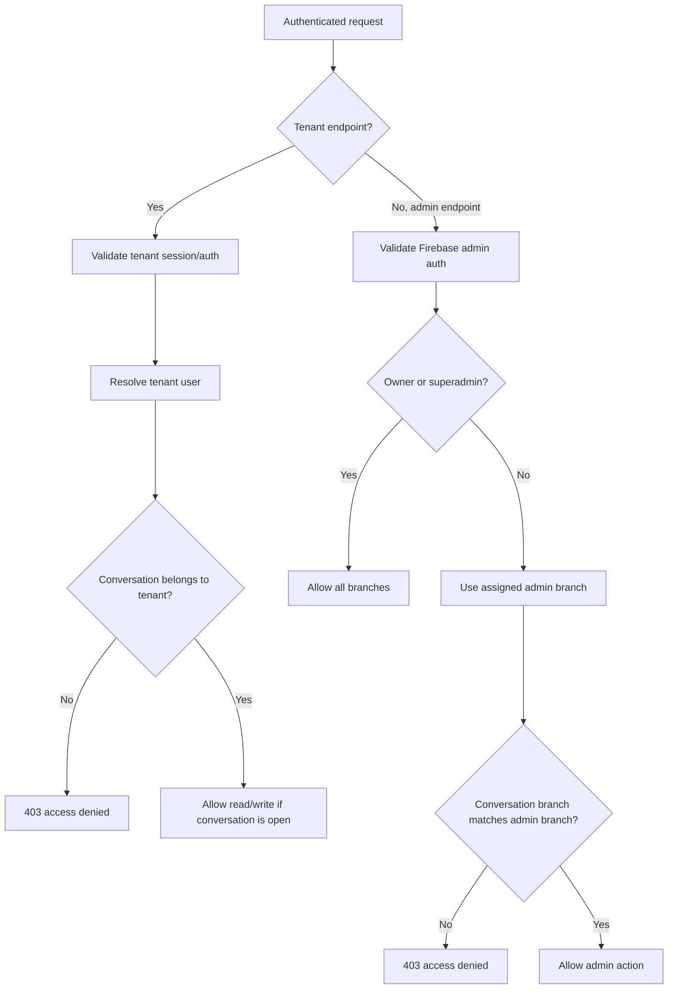
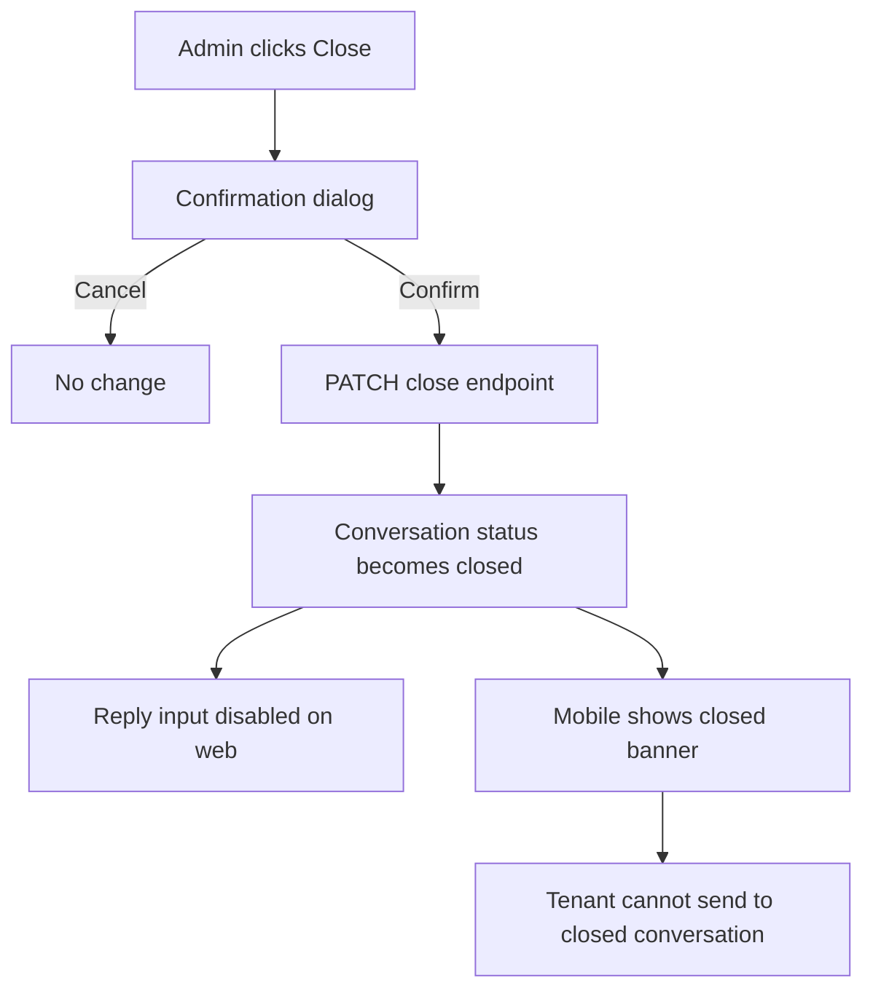

# LilyCrest Support Chat System Artifacts

## Scope

This document describes the current MVP human support chat flow:

- Tenant Mobile App to Web Admin Dashboard
- Persistent conversation and message history
- Branch-scoped admin visibility
- Category, priority, and admin assignment metadata
- Helpdesk status workflow
- Admin chat transcript PDF export
- Branch-scoped Socket.IO updates for web admins with polling fallback
- No AI chatbot behavior in this support-chat flow

## Current System Overview

The support chat is implemented as a persistent human-admin messaging flow.

The mobile app uses the existing mobile session-token backend under `/api/m/chat`.
The web admin dashboard uses the web backend under `/api/chat`.
Both backends write to the same MongoDB collections:

- `chat_conversations`
- `chat_messages`

This keeps the mobile app authentication flow intact while allowing the web admin dashboard to read and reply to the same conversations.

## Professional Workflow Enhancements

The support chat now behaves more like a lightweight helpdesk:

- New tenant conversations require a category.
- `Urgent Issue` conversations are automatically tagged as urgent.
- Admins can assign a conversation to themselves.
- Admins can update status and priority.
- Admin replies move conversations to `Waiting for Tenant`.
- Tenant replies move conversations back to `Open`.
- Closing a conversation requires a closing note.
- Admins can download a PDF transcript from the selected conversation.

## Primary Actors

| Actor | Platform | Access |
| --- | --- | --- |
| Tenant | LilyCrest mobile app | Own conversations only |
| Branch Admin | Web admin dashboard | Conversations for assigned branch only |
| Owner | Web admin dashboard | All branch conversations |
| Superadmin | Backend-supported role | All branch conversations |

## Main Process Flow



## Tenant Mobile Flow

1. Tenant opens the Chat tab.
2. Mobile initializes support chat by calling:

   `POST /api/m/chat/start`

3. Backend validates the tenant session token.
4. Backend resolves tenant branch and room from active stay, bed history, or reservation data.
5. If the tenant has an active non-closed conversation, it is returned.
6. If no active conversation exists, tenant must choose a category before the first message creates a new conversation.
7. Mobile loads messages using:

   `GET /api/m/chat/:conversationId/messages`

8. Tenant sends a message using:

   `POST /api/m/chat/:conversationId/messages`

9. Empty messages, overlong messages, and closed conversations are blocked.
10. Mobile polls for new messages every 7 seconds while the screen is focused.
11. Mobile polls conversation history every 12 seconds.

## Web Admin Flow

1. Admin opens `Support Chat` from the admin sidebar.
2. Web dashboard loads conversations using:

   `GET /api/chat/admin/conversations`

3. Admin can filter by:

   - Search
   - Status: open, in review, waiting for tenant, resolved, closed, all
   - Unread only
   - Urgent/priority
   - Category
   - Assigned to me
   - Branch, for owner-level users

4. Admin selects a conversation.
5. Web loads messages using:

   `GET /api/chat/admin/conversations/:conversationId/messages`

6. Opening a conversation marks tenant messages as read for the admin.
7. Admin sends a reply using:

   `POST /api/chat/admin/conversations/:conversationId/messages`

8. Reply increments tenant unread count.
9. Admin can assign the conversation, update priority, update status, or download a PDF transcript.
10. Admin can close the conversation using:

   `PATCH /api/chat/admin/conversations/:conversationId/close`

11. Closed conversations remain visible but cannot receive new replies.

## Access Control Flow



## Data Model

### `chat_conversations`

| Field | Purpose |
| --- | --- |
| `tenantId` | Mongo user id for tenant |
| `tenantUserId` | Mobile/string user id fallback |
| `tenantName` | Display name in admin list |
| `tenantEmail` | Tenant email if available |
| `branch` | Branch used for admin scoping |
| `roomNumber` | Room display |
| `roomBed` | Bed display |
| `status` | `open`, `in_review`, `waiting_tenant`, `resolved`, or `closed` |
| `category` | Billing, maintenance, reservation, payment, general, or urgent |
| `priority` | `normal`, `high`, or `urgent` |
| `assignedAdminId` | Assigned admin user id |
| `assignedAdminName` | Assigned admin display name |
| `lastMessage` | Conversation preview |
| `lastMessageAt` | Sort and display timestamp |
| `unreadAdminCount` | Tenant messages unread by admin |
| `unreadTenantCount` | Admin messages unread by tenant |
| `closedAt` | Close timestamp |
| `closedBy` | Admin user who closed it |
| `closingNote` | Required admin note when closing |
| `statusHistory` | Compact workflow history |

### `chat_messages`

| Field | Purpose |
| --- | --- |
| `conversationId` | Parent conversation |
| `senderId` | Mongo user id |
| `senderUserId` | Mobile/string user id fallback |
| `senderName` | Display sender name |
| `senderRole` | `tenant`, `admin`, `owner`, or `superadmin` |
| `message` | Text body |
| `readAt` | Timestamp once read |
| `createdAt` | Message timestamp |

## API Contract

### Tenant and Mobile

#### `POST /api/m/chat/start`

Creates or returns the tenant's open conversation.

Request when creating a new conversation:

```json
{
  "category": "billing_concern",
  "priority": "normal"
}
```

Response:

```json
{
  "conversation": {
    "id": "string",
    "tenantId": "string",
    "tenantName": "string",
    "branch": "gil-puyat",
    "roomNumber": "302",
    "roomBed": "lower A",
    "status": "open",
    "category": "billing_concern",
    "priority": "normal",
    "assignedAdminName": "",
    "lastMessage": "",
    "lastMessageAt": null,
    "unreadAdminCount": 0,
    "unreadTenantCount": 0
  }
}
```

#### `GET /api/m/chat/me`

Returns tenant conversation history.

#### `GET /api/m/chat/:conversationId/messages`

Returns messages for one tenant-owned conversation.

#### `POST /api/m/chat/:conversationId/messages`

Request:

```json
{
  "message": "Hello admin"
}
```

Response:

```json
{
  "message": {
    "id": "string",
    "conversationId": "string",
    "senderRole": "tenant",
    "message": "Hello admin",
    "createdAt": "date"
  },
  "conversation": {}
}
```

### Web Admin

#### `GET /api/chat/admin/conversations`

Optional query parameters:

- `branch`
- `status`
- `unread=true`
- `search`
- `category`
- `priority`
- `assigned=me`

#### `GET /api/chat/admin/conversations/:conversationId/messages`

Returns selected conversation messages and marks tenant messages as read by admin.

#### `POST /api/chat/admin/conversations/:conversationId/messages`

Admin reply.

#### `PATCH /api/chat/admin/conversations/:conversationId/read`

Marks tenant messages as read by admin.

#### `PATCH /api/chat/admin/conversations/:conversationId/close`

Closes the conversation.

Request:

```json
{
  "note": "Concern resolved and tenant informed."
}
```

#### `PATCH /api/chat/admin/conversations/:conversationId/assign`

Assigns the conversation to the current admin or a provided admin id.

#### `PATCH /api/chat/admin/conversations/:conversationId/status`

Updates the helpdesk status.

#### `PATCH /api/chat/admin/conversations/:conversationId/priority`

Updates the priority tag.

## Validation Rules

| Rule | Error |
| --- | --- |
| Empty message | `Message cannot be empty.` |
| Message over 1000 characters | `Message must be 1000 characters or fewer.` |
| Missing first-chat category | `Category is required.` |
| Invalid conversation id | `Conversation not found.` |
| Unauthorized tenant/admin access | `You do not have access to this conversation.` |
| Sending to closed conversation | `This conversation is closed.` |
| Tenant has no active tenant context | `No active tenant.` |
| Closing without note | `Please enter a closing note.` |

## UI Feedback Rules Implemented

### Mobile

- Loading state while support chat starts.
- Loading state for message history.
- Send button disabled while empty, sending, loading, or closed.
- Inline error for empty/invalid send.
- Success banner after sending.
- New reply feedback when polling sees an admin reply.
- Closed conversation banner.
- Category picker before starting a new conversation.
- Category, priority, and status labels.
- Help text that explains the current conversation state.
- Empty chat state.
- Conversation history empty state.

### Web Admin

- Loading state for conversation list.
- Loading state for selected messages.
- Disabled reply button while empty or sending.
- Success toast after reply.
- Error toast and inline reply error on failed send.
- Assignment success/error feedback.
- Status change success/error feedback.
- Priority change success/error feedback.
- Transcript PDF loading/success/error feedback.
- Close confirmation dialog.
- Required closing note validation.
- Success toast after close.
- Empty conversation list state.
- Empty selected-conversation state.
- Unread badges in the conversation list.

## Notification Behavior

Current notification behavior:

- Tenant sends message:
  - `unreadAdminCount` increments.
  - Web/admin notification records are created when matching admins are found.
  - Urgent conversations use an urgent admin notification title.

- Admin replies:
  - `unreadTenantCount` increments.
  - Tenant notification record is created with:
    - Title: `New Admin Reply`
    - Message: `You received a reply from LilyCrest Admin.`

Current limitation:

- Mobile push from the web backend to the mobile device is not fully wired end to end yet.
- Mobile still sees replies through polling.

## Chat Transcript PDF

The admin dashboard can generate a PDF transcript for the selected conversation.

The PDF includes:

- Tenant details
- Branch and room/bed
- Category
- Priority
- Status
- Assigned admin
- Closed date and closing note
- Full message history with timestamps

The transcript is generated client-side from the selected conversation and loaded messages. This keeps the backend PDF billing utilities untouched.

## Close Conversation Behavior



MVP decision:

- Closed conversations are locked.
- When a tenant starts chat again after closure, the system creates a new open conversation instead of reopening the old one.
- This preserves historical closure context and avoids modifying old conversations.

## Realtime and Polling Strategy

| Client | Target | Interval |
| --- | --- | --- |
| Mobile | Selected messages | 7 seconds |
| Mobile | Conversation history | 12 seconds |
| Web admin | Socket.IO chat events | Realtime when connected |
| Web admin | Conversation list fallback | 30 seconds when socket is connected, 10 seconds when disconnected |
| Web admin | Selected messages fallback | 10 seconds when socket is disconnected |

Reason:

- Mobile remains polling-only for MVP deployment.
- Web admin uses token-authenticated Socket.IO rooms scoped by branch, with owners receiving all branch chat events.
- Polling remains as a resilience fallback if the socket disconnects.

## Files Added or Modified

### Web Backend

- `server/models/ChatConversation.js`
- `server/models/ChatMessage.js`
- `server/controllers/chatController.js`
- `server/routes/chatRoutes.js`
- `server/models/index.js`
- `server/server.js`

### Web Frontend

- `web/src/shared/api/chatApi.js`
- `web/src/shared/api/apiClient.js`
- `web/src/app/lazyPages.js`
- `web/src/app/routes/adminRoutes.jsx`
- `web/src/features/admin/components/sidebarConfig.mjs`
- `web/src/features/admin/components/adminShellMeta.mjs`
- `web/src/features/admin/pages/AdminChatPage.jsx`
- `web/src/features/admin/styles/admin-chat.css`

### Mobile Backend

- `LilyCrest-Clean/backend/controllers/chat.controller.js`
- `LilyCrest-Clean/backend/routes/chat.routes.js`
- `LilyCrest-Clean/backend/routes/index.js`

### Mobile Frontend

- `LilyCrest-Clean/frontend/src/services/chatApi.js`
- `LilyCrest-Clean/frontend/src/screens/TenantSupportChatScreen.jsx`
- `LilyCrest-Clean/frontend/app/(tabs)/chatbot.jsx`

### Workspace

- `Capstone-LilyCrest.code-workspace`

## Manual Test Cases

1. Tenant opens support chat and gets an open conversation.
2. Tenant sends a valid message.
3. Empty tenant message is blocked.
4. Very long tenant message is blocked.
5. Admin sees the tenant conversation on web.
6. Branch admin cannot see other branch conversations.
7. Owner sees all branch conversations.
8. Admin opens a conversation and unread admin count clears.
9. Admin sends a reply.
10. Tenant sees admin reply after polling.
11. Messages remain after mobile reopen or web refresh.
12. Admin closes the conversation.
13. Tenant cannot send to closed conversation.
14. A new tenant start after closure creates a new open conversation.
15. Network/server errors show visible feedback.

## Current Limitations

- Mobile support chat is still polling-only.
- No file attachments in chat messages.
- No tenant-facing typing indicators in the mobile app yet.
- No mobile push delivery from the web backend yet.
- No admin-side chat analytics yet.
- No server-side idempotency key for duplicate message retries yet.

## Recommended Next Improvements

1. Add mobile Socket.IO or push delivery for tenant replies.
2. Add attachment support with the existing upload pattern.
3. Add server-side idempotency keys for message sends.
4. Add chat notification push bridge for mobile devices.
5. Add audit logging for message sends and conversation closures.
6. Add admin-side chat analytics and SLA reporting.
