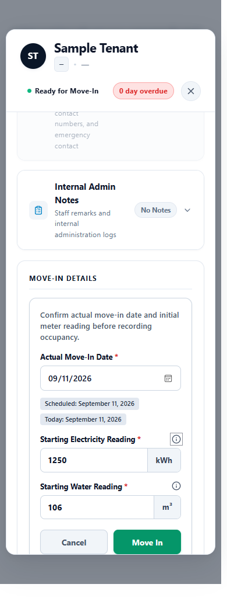

# Water billing implementation report

2026-09-11. Scope: versioned, measured water billing for Gil Puyat Private and Double/Sharing rooms. Quad and Guadalupe remain excluded. API, web, statements and backend mobile projections are implemented. Native clients are blocked. No production database migration or deployment was performed.

## Blocker-fix pass after the pre-merge audit

F1/F2/F3/F4/F5/F6/F8 acceptance regressions pass at code/test head `edd373c1`. [The pre-merge report](WATER_BILLING_PREMERGE_VALIDATION.md) records the fixes, test provenance and current readiness matrix; its original `bf2bccfa` audit is explicitly historical.

- Measured opening evidence is immutable through PATCH. An intentional open-period rate edit atomically updates both the period field and pricing snapshot with actor/time/previous-rate audit; closed snapshots remain immutable.
- Preview and generation use one canonical room/date observation and BedHistory resolver, independent of archived period links. The stored calculation inputs/fingerprint verify matching boundaries, segments, participants, price and money.
- Water writes validate previous, following and same-instant observations; corrections use supersession. A read-only cutover command reports READY/BLOCKED without manufacturing evidence.
- Transfer displays separate source/destination water baselines and dates. Move-in clears unsaved inputs on every requested lifecycle transition.
- Tenant/mobile details use stored allocation identity and display each allocation's own usage/amount. Utility result and related operations enforce branch scope before disclosure, preserving existing owner RBAC.

Commits: `a0576907`, `a6096d45`, `0ec04a83`, `1cfc132b`, `edd373c1`, followed by documentation/evidence. New schema fields are `UtilityPeriod.pricingAudit`, `calculationInputs` and `calculationFingerprint`; no new index is introduced by this fix pass.

Current acceptance evidence:33 focused backend tests and1,002 full frontend tests pass, including24 new backend cases and7 new component cases. Browser checks pass at1440px/390px with mocked APIs. The full server run passed352 suites/3,420 tests (689.894s); the final33-test focused run covers the last added authorization case and controller changes. The production build passed in3m45s. Hosted-head results are recorded in the final handoff and PR checks. Older counts below describe the original implementation run.

Remaining non-blocking issues: pre-existing F7 PDF header overlap with long names, unused legacy utility PDF helper, raw overdue DTO water component. Native Android/iOS and production verification remain unperformed.

## A. Branch

`feat/versioned-water-meter-billing`, based on main with the latest main changes integrated through `625645f0`. The feature has not been merged into main.

## B. Commit SHAs

| Commit | Change |
| --- | --- |
| `a499c592` | Historical safety and additive allocation identity |
| `75fea5d0` | Versioned observations, canonical measured engine and allocation dispatch |
| `2554c177` | Atomic move-in observation and existing inline panel |
| `9d0f49a2` | Physical transfer and move-out boundaries; rollback coverage |
| `37fe5d36` | Admin canonical previews and audit tables |
| `f95a81b0` | Tenant web and mobile API projections |
| `a77792fd` | Notification identity, statements and reports |
| `f31206bd` | Concurrent publication guard, corrections and runtime fixes |
| `a634c74f` | Integrate current main without conflicts |
| `993c5a1b` | Consistent editable PHP/m³ tariff labels |
| `a5da99cf` | Cutover guide, A–T report and visual evidence |

Documentation commits follow these implementation commits; the PR commit list is the authoritative complete history.

## C. Files changed

The complete implementation file list is in [WATER_BILLING_CHANGED_FILES.txt](WATER_BILLING_CHANGED_FILES.txt), relative to current main. Changes are concentrated in utility billing, occupancy lifecycle, additive model fields, tenant projection, notifications, statement generation and their tests. Existing electricity calculations retain their original engine path.

## D. Schema and index changes

| Model | Additive contract |
| --- | --- |
| UtilityPeriod | Calculation version, unit, audited open-period pricing snapshot (immutable after calculation), pricing audit, canonical meter events and calculation inputs/fingerprint |
| UtilityReading | m3 unit, observed timestamp, reservation/stay/transfer references, source/evidence and supersession audit metadata |
| Bill | Independently identified water allocations, dispatch state and supplemental invoice key; existing charges.water remains the aggregate |
| BedHistory | Exact observed occupancy start/end timestamps for water, alongside existing date fields |
| Room | Observation revision used to serialize concurrent meter writes |
| Reservation | Separate physical final electricity/water readings and water liability status |
| Notification | Persisted additive data payload matching realtime/push identity |

New index: unique sparse `Bill.waterSupplementKey`, named `unique_water_supplement`. Existing utility lifecycle indexes remain required. See the cutover guide for the explicit index command; it has not been run against production. No new occupancy or meter authority was introduced.

## E. Historical compatibility

An absent calculation version retains legacy semantics. Old recorded money remains money; unknown readings, physical consumption and unit prices remain null in canonical projections. New allocations can coexist with preserved legacy money. Issued, released, sent, partially paid and paid utility history cannot be destructively removed, including through force deletion. Unpublished correction workflows retain observations and supersession metadata.

Draft water is excluded from tenant balances and payment amounts. Dispatch includes each allocation once. If the original invoice is paid before dispatch, the water charge goes to a separately identified supplemental invoice and the paid document remains unchanged. Combined publication rechecks stale drafts transactionally.

## F. Move-in

The existing Move-In Details inline panel now shows Actual Move-In Date, Starting Electricity Reading (kWh), then Starting Water Reading (m³), with the same single Move In submission. There is no price field in this panel. Labeled inputs, keyboard-operable previous-reading helpers, required/non-negative validation and backend continuity validation apply. Water creation shares the reservation, Stay, BedHistory, role and occupancy transaction; injected water failures roll everything back.



## G. Transfer

Scheduling stores no water reading. Physical Complete Transfer requires fresh readings for each eligible source/destination room, using the existing completion dialog. Both observations and occupancy history commit atomically. Eligibility is evaluated separately for the two rooms. The architecture uses room meters; it has no separate shared-meter entity. Observations for the same room and instant must agree.

## H. Move-out

Eligible move-out requires a final physical water observation and closes the occupancy interval inside the transaction. Raw meter values are stored separately from financial amounts. Water liability remains pending period closing; this does not fabricate a settlement charge or modify paid history. The tenant workspace DTO includes the room identity/type needed to show the correct fields.

## I. Calculation formula

`water-meter-v1` uses consecutive verified observations:

```
segment usage = closing reading - opening reading
tenant segment usage = segment usage / occupants present in that segment
tenant charge = sum(tenant segment usage) * saved PHP/m³ rate
```

Private has one occupant; Double has at most two. All room occupancy intervals are resolved, including leave/return and transfers. Occupancy identifies the people in each measured interval; elapsed days never stand in for consumption. Missing change boundaries, decreasing readings and conflicting simultaneous observations block calculation. Vacancy consumption is room overhead. Tenant currency totals use deterministic largest-remainder cent allocation.

The approved 100 → 106 → 118 example yields A=12 m³ and B=6 m³. At PHP50/m³ the charges are PHP600 and PHP300. One backend engine powers preview, persisted close, review, tenant/mobile projections and PDF tables.

## J. Rate configuration

The existing authorized settings workflow edits the water tariff in PHP/m³ with decimal validation and its existing audit trail. Period creation captures the rate, unit, actor and timestamp. Existing active periods preview and close using their saved rate. Updating the current setting does not reprice historical bills. Review the configured value before cutover because an older room-total value must not silently become a unit tariff.

## K. Admin UI

Water retains the electricity billing layout and shared component language. Opening/closing readings, consumption, PHP/m³ rate and calculated amount use the canonical API preview. The three auditable tables are Meter Reading History, Consumption Segments and Tenant Allocation. Cycle detail, generic bill detail, tenant payment tables, exports and KPI units distinguish measured and legacy periods. Water correction requires a reason and preserves the observation time/event; issued snapshots remain protected.

## L. Tenant web

Tenant water details show canonical meter history, consumption segments and allocation tables. Multiple period/room allocations remain individually identifiable, without pretending they share one opening reading or rate. Legacy displays unknown physical values and recorded money. The `billId` query parameter resets filters, expands and focuses the matching bill card. Browser-side water calculation is not used.

## M. Android status

**BLOCKED:** Android/shared mobile client source is absent. Backend payload tests passed; no Android screen or installed-device notification tap was validated.

## N. iOS status

**BLOCKED:** iOS/shared mobile client source is absent. Backend payload tests passed; no iOS screen or installed-device notification tap was validated.

## O. Notifications

Water dispatch retains the canonical bill notification lifecycle. Persisted data, realtime and push payloads include bill, utility, period/allocation identity and billing detail routing. Smoke tests verify one event across repeated dispatch and a separate event for a different allocation/period on the same bill. Existing read, clear, unread and role-filter behavior stays under regression coverage. Web exact-bill focus is implemented; authenticated end-to-end notification tapping and native device routing are not claimed.

## P. PDF and reports

Statement template v5 includes all three water tables, wrapped cells and truthful legacy fallback. Payment receipt meaning is unchanged. A generated [sample PDF](water-billing-evidence/water-statement-sample.pdf) was rendered and visually inspected for clipping and alignment. Report tests reconcile visible sent water with billed, paid and outstanding totals, excluding unsent draft allocations. New exports report measured units and price; legacy physical fields stay blank.

## Q. Tests and verification

Original implementation full local server regression: **351 suites, 3,397 tests passed, zero failures** (756.839 seconds). This includes the integration suites and existing electricity/payment regressions. The earlier environment-dependent maintenance timeout was fixed by isolating that deterministic fallback from live AI configuration; the final full run passed.

Commands run in their respective package directories:

```powershell
# server: all tests, including isolated MongoDB integration suites
npm.cmd test -- --maxWorkers=2 --workerIdleMemoryLimit=512MB --forceExit
# web
npm.cmd test
npm.cmd run build
```

- Final targeted financial/statement/notification safeguards: **6 suites, 50 tests passed**.
- Transfer regression group: **12 suites, 115 tests passed**.
- Core water group: **4 suites, 38 tests passed**.
- Frontend after integrating current main: **995 tests passed, zero failures**.
- Final production web build: **passed** (3m15s), including the final water tariff labels.
- Hosted CI on implementation/evidence commit `a5da99cf`: **286 server suites / 2,903 tests passed**, **995 frontend tests passed**, production build and preview deployment passed. Hosted server CI excludes integration tests; the full local run above includes them.
- Component fixture browser QA: actual React components rendered at 390px and 1440px, including Move-In, Open/Close/New period, Complete Transfer, Move-Out and shared tables. Final renders had no page errors; narrow tables and modal actions remained reachable. This used isolated sample data, not authenticated production workflows.

Test groups overlap and must not be added together. MongoDB integration tests use isolated test fixtures. Existing payment/PayMongo tests use mocks; no live payment was made.

| Requested scenarios | Evidence |
| --- | --- |
| 1–4: move-in, missing/lower baseline, rollback | reservationLifecycleController.moveInContractRepair.integration; waterMeterBilling.integration |
| 5–12: Private, Double, arrivals/departures/replacement/return | waterMeterEngine.test; room-scoped utility integration suites |
| 13: Quad exclusion | waterMeterEngine.test; lifecycle/transfer fixtures; move-in visual fixture |
| 14–16: immediate/scheduled transfer and rollback | transferAtomicCutover.integration; scheduledRoomTransfer.meterTiming.integration |
| 17: move-out boundary | transferThenRenewMoveOut.integration; move-out fixture |
| 18–19: editable rate and historical snapshot | existing settings regression; waterMeterEngine.test; waterMeterBilling.integration |
| 20–23: duplicates, additive allocations, draft/sent visibility | waterAllocations.test; waterMeterBilling.integration; billingPolicy tests |
| 24–25: partial payment and immutable paid history | existing billing/payment ledger suites; utilityHistorySafety.test; dispatch race integration |
| 26–27: dedupe and exact bill identity | billReleaseNotificationSmoke.test; tenant billId focus implementation; native/runtime gap above |
| 28–29: tenant tables and mobile backend | WaterBillingTables.test.mjs plus visual fixture; mobileBillingBridge.test |
| 30–31: Android/iOS | BLOCKED: client source/device validation unavailable |
| 32–35: PDF, reports, mixed history and units | pdfGenerator.statement.test; analyticsController.test; waterAllocations/mobile projection tests; UI source review and visual fixtures |

## R. Migration and cutover

Follow [WATER_METER_CUTOVER.md](WATER_METER_CUTOVER.md). Review the PHP/m³ rate and indexes, finish legacy cycles under their original rules, and start each measured cycle prospectively at a verified physical boundary. Rooms without trustworthy historical measurements start at the new observation. Do not backfill fictional readings or relabel old usage.

## S. Known blockers and limits

- Native clients and installed-device routing remain blocked as described above.
- Production index execution, configuration review, physical baseline collection and deployment have not been performed.
- Fixture browser checks do not claim authenticated end-to-end operation, live push delivery or live PayMongo settlement.
- Missing historic occupancy-change observations intentionally block measured closing; they require a prospective cutover, not interpolation.

## T. PR status

[Draft PR #172](https://github.com/kuurz-z/Capstone-Website/pull/172) is open and unmerged. Hosted server/frontend CI and the preview deployment passed on `a5da99cf`, including 2,903 server tests and 995 frontend tests. The final documentation-only update records the full local regression results and triggers the normal checks again; the PR check panel is authoritative for that final commit. No production deployment or migration was performed.
